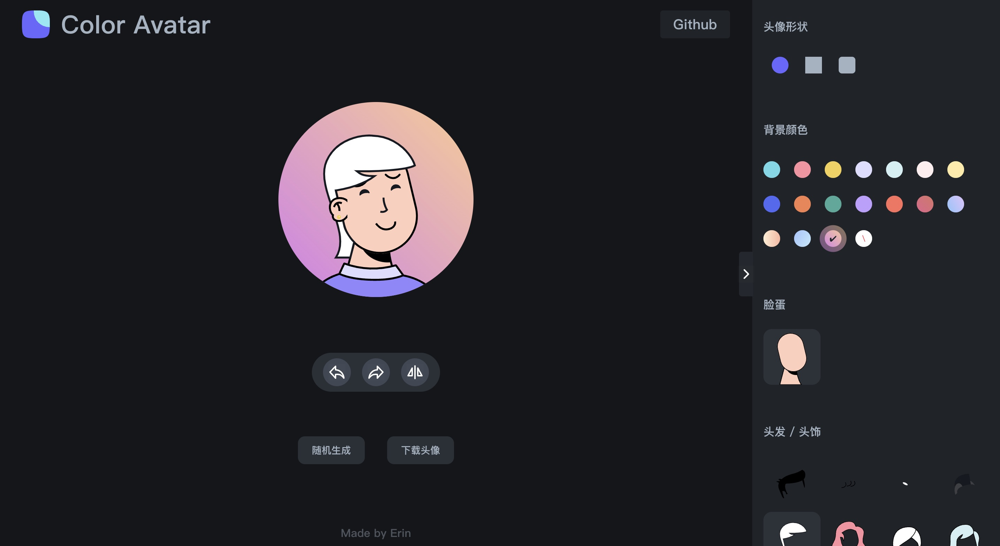

# react-color-avatar

一个纯前端实现的头像生成网站

> 参照 https://github.com/Codennnn/vue-color-avatar （vue版本） 开发



## 技术栈

```javascript
react (hooks)
redux
typeScript
```

## 本地运行

```javascript
// 安装依赖
npm install 或 yarn(推荐)

// 运行项目
npm start

// 打包项目
npm build
```
